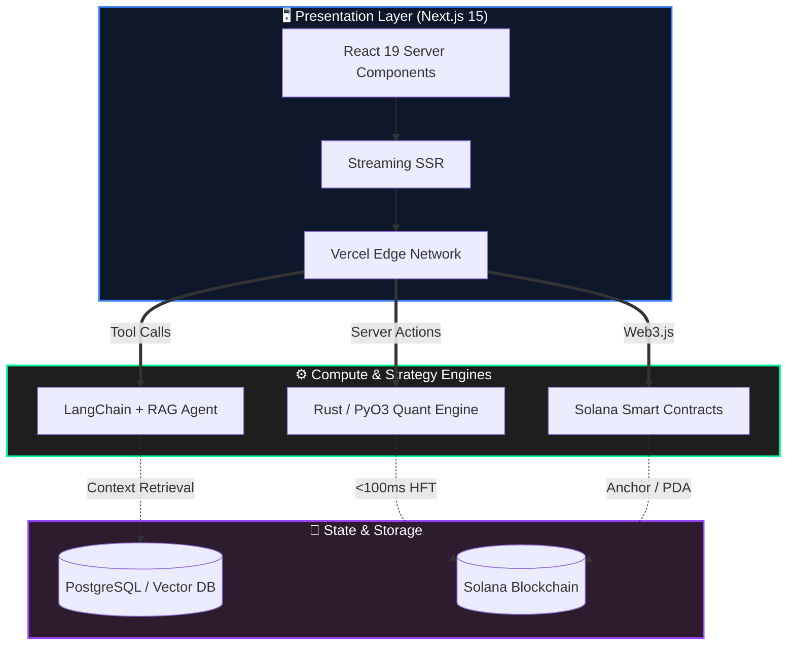

<div align="center">
  
</div>

<!-- 核心身份卡片：左右分栏布局 -->
<table align="center" border="0" width="100%">
  <tr>
    <td width="55%" valign="top">
      <h3 align="left">👨‍💻 Source Code Identity</h3>
      <pre>
```rust
struct YuhangZhao {
    role: "Web3 & AI Architect",
    location: "Shenzhen, CN",
    codebase: ["Rust", "TypeScript", "Python"],
    specialty: {
        frontend: "Next.js 15 (Contributor) / RSC",
        blockchain: "Solana / Anchor / PDA",
        quant: "HFT Strategy / Backtrader",
        ai: "RAG / Agentic Workflows"
    },
    status: "Building High-Perf Systems"
}
```
      </pre>
      <div align="left">
        <a href="http://icstudio.top/">
            
        </a>
      </div>
    </td>
    <td width="45%" valign="top" align="center">
      <h3 align="center">📊 GitHub Stats</h3>
      
    </td>
  </tr>
</table>

<br/>

<!-- 技术军火库：不再是简单的徽章堆砌，而是按层级分类 -->
<h3 align="center">🛠️ Technical Arsenal</h3>

<div align="center">

| **Layer**            | **Technologies (High Proficiency)**                                                                                                                                                                                                                                                                         |
| :------------------- | :---------------------------------------------------------------------------------------------------------------------------------------------------------------------------------------------------------------------------------------------------------------------------------------------------------- |
| **Interface & Core** |     |
| **On-Chain Logic**   |                                        |
| **Intelligence**     |                                    |
| **Quant & Backend**  |                           |

</div>

<p align="center"><i>Integrating High-Performance Compute with Decentralized Logic</i></p>


<!-- 底部动态贪吃蛇：体现活跃度 -->
<div align="center">

</div>
<div align="center">
<br/>
<i>"Talk is cheap. I optimize the code."</i>
<br/>
<br/>
<a href="mailto:murder051215@outlook.com">

</a>
</div>
```

<!---
MapleCity1314/MapleCity1314 is a ✨ special ✨ repository because its `README.md` (this file) appears on your GitHub profile.
You can click the Preview link to take a look at your changes.
--->
