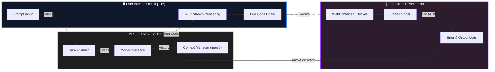

<div align="center">
  
</div>

<!-- 核心身份卡片 -->
<table align="center" border="0" width="100%">
  <tr>
    <td width="60%" valign="top">
      <h3 align="left">👨‍💻 Source Code Identity</h3>
      <pre>
```rust
struct Presto {
    name: "Zhao Yuhang",
    age: 20,
    location: "Hangzhou, CN",
    role: "AI Native Fullstack Engineer",
    achievements: [
        "Next.js Contributor",
        "Huawei Certified ICT Associate (HCIA)"
    ],
    tech_focus: {
        core: "Next.js 16 / React 19 / RSC",
        backend: "Go / Rust / Nest.js",
        ai_stack: "LangChain / Vercel AI SDK / RAG",
        infra: "Docker / WebContainers"
    },
    status: "Building the z0 Ecosystem"
}
```
      </pre>
      <div align="left">
        <a href="mailto:murder051215@outlook.com">
            
        </a>
        <a href="http://icstudio.top/">
            
        </a>
      </div>
    </td>
    <td width="40%" valign="top" align="center">
      <h3 align="center">📊 GitHub Stats</h3>
      
      <br/>
      
    </td>
  </tr>
</table>

<br/>

<!-- 技术军火库 -->
<h3 align="center">🛠️ Technical Arsenal</h3>

<div align="center">

| **Domain** | **Stack Components** |
| :--- | :--- |
| **Next-Gen Frontend** |     |
| **Backend & Systems** |     |
| **AI Engineering** |     |
| **DevOps & Tools** |     |

</div>

<br/>

<!-- 项目展示：根据简历中的 z0 系列重构 -->
<h3 align="center">🚀 Featured Projects: The z0 Series</h3>
<p align="center"><i>High-performance AI Engineering & System Architecture</i></p>

<table border="0" width="100%">
  <tr>
    <td width="50%" valign="top">
      <h4>🧠 z0 Gateway (AI Infra)</h4>
      <p>A high-concurrency Model-as-a-Service gateway unifying OpenAI/Local models.</p>
      <ul>
        <li><b>Stack:</b> Go, WebSocket, Postgres, Workflow SDK</li>
        <li><b>Impact:</b> Reduced model integration costs by 70%, ms-level streaming.</li>
      </ul>
    </td>
    <td width="50%" valign="top">
      <h4>🤖 z0 Agent (Vibe Coding)</h4>
      <p>Web-based AI Agent system for complex task execution & code generation.</p>
      <ul>
        <li><b>Stack:</b> Next.js 16, React 19, Server Actions, mem0</li>
        <li><b>Feature:</b> "Plan/Execute/Feedback" loop with WebContainer sandbox.</li>
      </ul>
    </td>
  </tr>
  <tr>
    <td width="50%" valign="top">
      <h4>📈 z0 Lens (Quant Platform)</h4>
      <p>Agent-driven quantitative research & visualization platform.</p>
      <ul>
        <li><b>Stack:</b> WebGL, WebSocket, Rust/Quant Engines</li>
        <li><b>Core:</b> Automated factor mining, IC/RankIC monitoring, backtesting.</li>
      </ul>
    </td>
    <td width="50%" valign="top">
      <h4>⚖️ z Judge (Online Judge)</h4>
      <p>Distributed AI-powered coding assessment system.</p>
      <ul>
        <li><b>Stack:</b> Nest.js, Docker Sandbox, Message Queue</li>
        <li><b>Perf:</b> Async task pipeline with secure isolation.</li>
      </ul>
    </td>
  </tr>
</table>

<br/>

<!-- 架构图：展示你简历中提到的 Agent Vibe Coding 逻辑 -->
<h3 align="center">🧩 Architecture: Agentic Workflow</h3>
<p align="center"><i>Visualizing the "Plan / Execute / Feedback" Loop from z0 Agent</i></p>



<!-- 底部动态图 -->
<div align="center">
<br/>

<br/>
<br/>
<i>"Turning technical capability into stable, scalable business value."</i>
</div>
